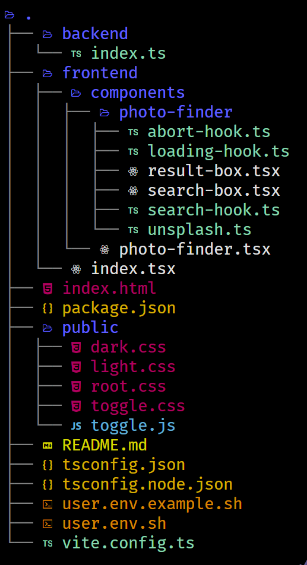

# rumor-exercise

A programming exercise.

## Table of Contents

1. [Try it](#try-it)
   1. [Online Sandbox](#online-sandbox)
   1. [Locally](#locally)
1. [Design](#design)
1. [Implementation](#implementation)
   1. [Infrastructure](#infrastructure)
   1. [Files and Folders ](#files-and-folders)
1. [Known Issues](#known-issues)

## Try It

### Online Sandbox

Will be available once I set it up

### Locally

Requires Node.js, pnpm (versions in [package.json](package.json)), and a
unix-like shell.

You can install and run the code as a standalone web application:

```bash
> git clone git@github.com:middle-ages/rumor-exercise.git
> cd rumor-exercise
> cp user.env.example.sh user.env
> vim user.env.sh # set your API tokens
> pnpm install
> pnpm build-server && build-client && start-server
```

## Design

### Requirements

A client and server implementing a user interface for a search operation:

**Input** - a stream of `KeyUp` events from a search box

**Output** - an updated list of search results for the search keywords in the
search box, merged from two different web APIs

### Client-Server Border

_Simplest thing_: no server, client does everything.

**But** for pedagogic reasons, we assume a server is required, for example for
security: firewalls only allow access to our server. Or for hiding tokens, as
per the service agreements, from clients.

The simplest design is to use the server as a proxy, passing through
requests /responses between client and web services unchanged. Client picks
image URLs from the results and requests them directly, as per the service
guidelines.

Our simple server requires no code sharing with our client so we can split the
source code:

1. Server code is under `backend/`
2. Client code is under `frontend/`

## Implementation

### Infrastructure

#### Typescript on Node.js

The project is configured to the latest available Node.js/Typescript
configuration:

1. `package.json#type="module"` - all source code is read as ESM code by Node.js
1. `tsconfig.json`
   1. `target="EsNext"`
   1. `module="NodeNext"`

One day all such projects will use this configuration, and it is the recommended
configuration for new projects with no legacy burden. It works well for simple
projects because it is supported by `tsc`+Node.js so requires no other build tool,
while still supporting [import
aliasing](https://www.typescriptlang.org/docs/handbook/esm-node.html#packagejson-exports-imports-and-self-referencing)
and other features usually requiring some other tool besides `tsc`.

#### Typescript in the Browser

While we could use the same configuration to build for the browser, it is not
practical yet, if only because it would hurt time to [First Contentful
Paint](https://web.dev/fcp/).

### Files and Folders



## Known Issues

Need a couple more hours to fix, ping me if you think it would help you decide
and I will complete these:

1. No placeholders for loading images
2. Error handling and recovery is sketchy at best
3. Client must wait for BOTH requests to complete. Would be better to merge the
   results on the client
4. CSS is all over the place and should be refactored, not to mention the
   brutalist style of the default controls which must be changed
5. Infinite scrolling masonry layout was out of my time budget so focused on the
   pagination aspect: it looks a little bit like a responsive masonry layout,
   but uses the primitive back/forward mechanism for browsing. In retrospect
   should have used a 3rd party commercial component which does this
   out-of-the-box
6. While the light/dark toggle, a control (more like a bunch of code to
   copy-paste) I wrote sometime ago, does work correctly in that:
   - theme is changed according to toggle
   - theme is set by OS preference, and we listen to OS preference change - set
     dark mode in chrome dev tools to test
     And that is no doubt good, all controls other than the toggle itself have
     only one style defined and it _light_. With more time, I would have used
     the same strategy I used to theme the fancy toggle on the rest of the page
7. Tested that _client_ correctly aborts/debounces requests in these cases:
   - Search while loading aborts running requests: only one request is live at
     any given moment
   - Component unmount/page navigation away while loading will abort
   - Typing quickly will debounce (800msec debounce timeout) and only after the
     timeout will a request be sent
     Most of the testing is made easier by throttling in Chrome dev tools, testing
     in the `network` tab that requests are canceled correctly. However did not
     test that debouncing cancels correctly, though I suspect it does
8. Some zoom on hover that will hint that clicking will fully zoom would be nice
9. Descriptions should be always shown, requiring user to lay motionless and wait
   for a tooltip to appear over an image is evil
10. That toggle button should be made into a React component


